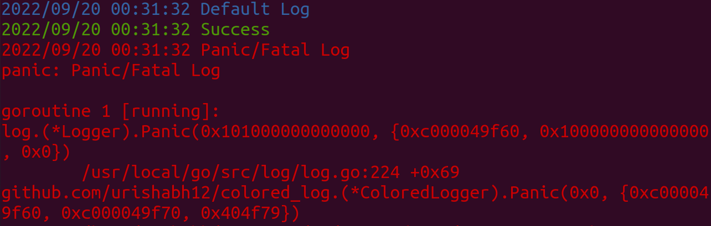

# Colored Log
🟥🟧🟨🟩🟦🟪 Colored logging in golang

## Example

### Code
```
import (
	log "github.com/urishabh12/colored_log"
)

func main() {
    log.Println("Default Log")
    log.Success("Success")
    log.Panic("Panic/Fatal Log")
}
```
### Output
<p align="center">

</p>

<p align="center"><a href="https://godoc.org/github.com/urishabh12/colored_log"></a></p>
